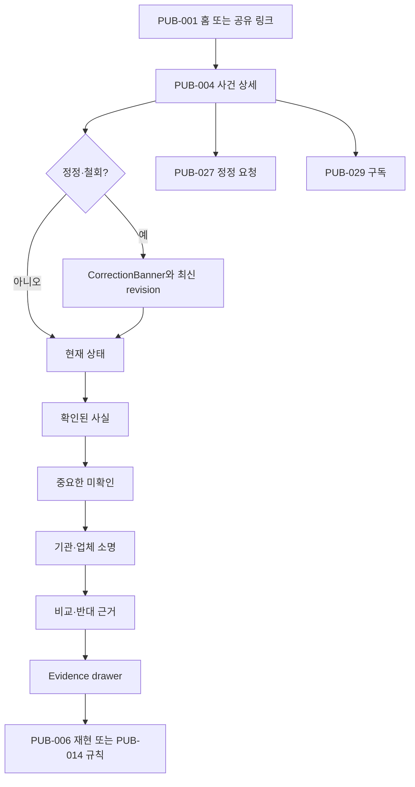

# Flow 01 — 시민의 사건 이해

## 성공 기준

- 30초 안에 현재 상태와 중요한 미확인을 설명한다.
- anomaly와 official confirmation을 구분한다.
- claim 하나의 원문 locator에 도달한다.
- correction이 있으면 과거본보다 최신 상태를 먼저 인지한다.

## 실패 복구

- source stale: 영향 source와 마지막 정상 시각을 표시한다.
- evidence 제한: 제한 사유와 편집 검증 여부를 표시한다.
- 404/철회: 기록을 사라지게 하지 않고 안내와 history를 제공한다.
