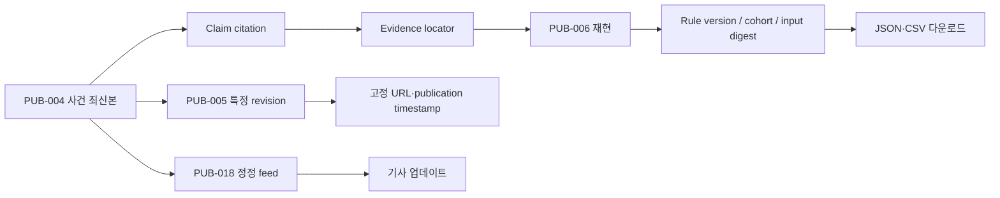

# Flow 02 — 기자의 재현과 인용

## 계약

- citation에는 case slug, revision, claim/evidence ID, 공개 시각이 포함된다.
- snapshot download는 checksum과 license를 가진다.
- 최신본과 특정 revision URL을 구분한다.
- 과거 URL에 correction/retraction notice가 유지된다.
