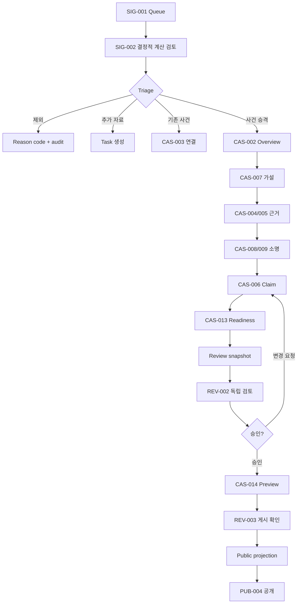

# Flow 03 — Signal에서 공개까지

## 불변조건

- AI output은 Signal calculation과 source evidence를 대체하지 않는다.
- factual claim은 evidence 없이 저장되지 않는다.
- response gate와 반대 근거 review를 건너뛰지 않는다.
- 변경된 case는 이전 snapshot approval을 재사용하지 않는다.
- 게시 command가 서버에서 모든 gate를 다시 계산한다.
