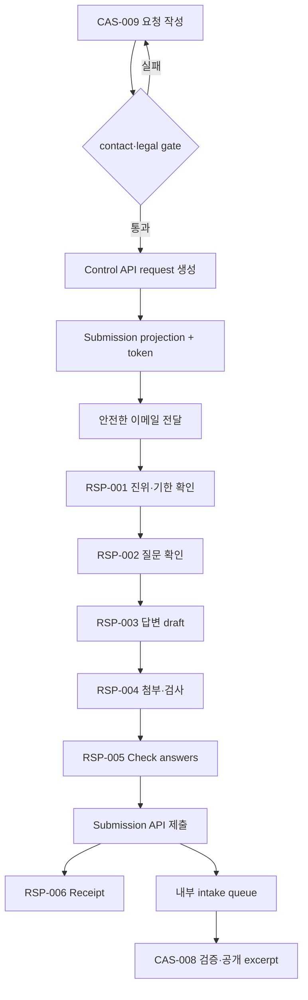

# Flow 04 — 소명 요청과 제출

## 경계

- Response Portal은 Control API를 호출하지 않는다.
- token은 다른 request를 조회할 수 없다.
- 제출은 publication 상태를 변경하지 않는다.
- 파일 검사 완료 전 최종 제출할 수 없다.
- third-party analytics와 referrer token 유출을 금지한다.
