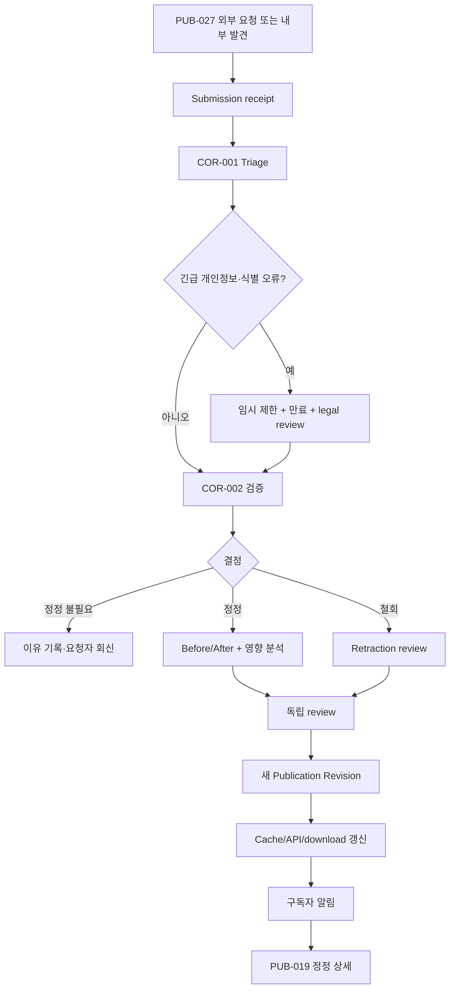

# Flow 05 — 정정·철회

```mermaid
flowchart TD
  A[PUB-027 외부 요청 또는 내부 발견] --> B[Submission receipt]
  B --> C[COR-001 Triage]
  C --> D{긴급 개인정보·식별 오류?}
  D -- 예 --> E[임시 제한 + 만료 + legal review]
  D -- 아니오 --> F[COR-002 검증]
  E --> F
  F --> G{결정}
  G -- 정정 불필요 --> H[이유 기록·요청자 회신]
  G -- 정정 --> I[Before/After + 영향 분석]
  G -- 철회 --> J[Retraction review]
  I --> K[독립 review]
  J --> K
  K --> L[새 Publication Revision]
  L --> M[Cache/API/download 갱신]
  M --> N[구독자 알림]
  N --> O[PUB-019 정정 상세]
```

## 불변조건

- 기존 publication revision은 변경하지 않는다.
- 긴급 요청이 자동 삭제를 뜻하지 않는다.
- 영향을 받는 API·download·search를 함께 갱신한다.
- root cause와 후속 개선을 기록한다.
