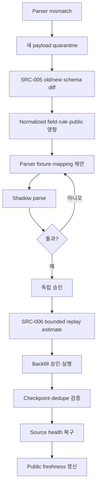

# Flow 06 — Source Schema Drift

```mermaid
flowchart TD
  A[Parser mismatch] --> B[새 payload quarantine]
  B --> C[SRC-005 old/new schema diff]
  C --> D[Normalized field·rule·public 영향]
  D --> E[Parser fixture·mapping 제안]
  E --> F[Shadow parse]
  F --> G{통과?}
  G -- 아니오 --> E
  G -- 예 --> H[독립 승인]
  H --> I[SRC-006 bounded replay estimate]
  I --> J[Backfill 승인·실행]
  J --> K[Checkpoint·dedupe 검증]
  K --> L[Source health 복구]
  L --> M[Public freshness 갱신]
```

## 불변조건

- schema drift를 조용히 무시하지 않는다.
- quarantine payload는 명령으로 취급하지 않는다.
- replay 전 영향·비용·중복 전략을 계산한다.
- public stale notice는 실제 회복 후 제거한다.
