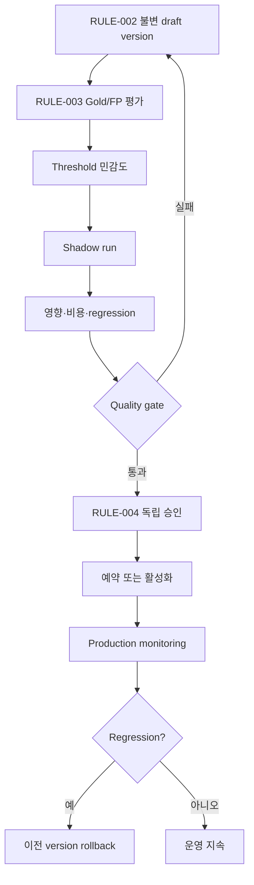

# Flow 07 — 규칙 평가와 활성화

```mermaid
flowchart TD
  A[RULE-002 불변 draft version] --> B[RULE-003 Gold/FP 평가]
  B --> C[Threshold 민감도]
  C --> D[Shadow run]
  D --> E[영향·비용·regression]
  E --> F{Quality gate}
  F -- 실패 --> A
  F -- 통과 --> G[RULE-004 독립 승인]
  G --> H[예약 또는 활성화]
  H --> I[Production monitoring]
  I --> J{Regression?}
  J -- 예 --> K[이전 version rollback]
  J -- 아니오 --> L[운영 지속]
```

## 불변조건

- active version을 in-place 수정하지 않는다.
- 제안자가 단독 승인하지 않는다.
- 평가 fixture를 코드에 맞춰 약화하지 않는다.
- rollback target과 effective time을 기록한다.
