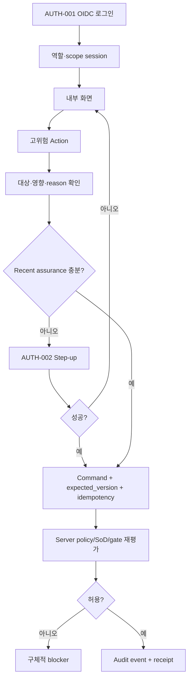

# Flow 08 — 인증·재인증·고위험 행동

```mermaid
flowchart TD
  A[AUTH-001 OIDC 로그인] --> B[역할·scope session]
  B --> C[내부 화면]
  C --> D[고위험 Action]
  D --> E[대상·영향·reason 확인]
  E --> F{Recent assurance 충분?}
  F -- 아니오 --> G[AUTH-002 Step-up]
  G --> H{성공?}
  H -- 아니오 --> C
  H -- 예 --> I[Command + expected_version + idempotency]
  F -- 예 --> I
  I --> J[Server policy/SoD/gate 재평가]
  J --> K{허용?}
  K -- 아니오 --> L[구체적 blocker]
  K -- 예 --> M[Audit event + receipt]
```

## 불변조건

- 메뉴 표시가 authorization이 아니다.
- 앱 자체 비밀번호를 받지 않는다.
- reauth 중 draft와 return path를 보존한다.
- generic “정말?”만으로 critical action을 실행하지 않는다.
