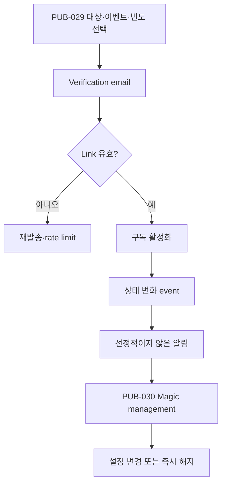

# Flow 09 — 이메일 구독

```mermaid
flowchart TD
  A[PUB-029 대상·이벤트·빈도 선택] --> B[Verification email]
  B --> C{Link 유효?}
  C -- 아니오 --> D[재발송·rate limit]
  C -- 예 --> E[구독 활성화]
  E --> F[상태 변화 event]
  F --> G[선정적이지 않은 알림]
  G --> H[PUB-030 Magic management]
  H --> I[설정 변경 또는 즉시 해지]
```

## 원칙

- 공개 읽기에 계정이 필요 없다.
- 이메일은 browsing analytics profile과 결합하지 않는다.
- correction/retraction 알림을 우선한다.
- one-click unsubscribe와 suppression을 제공한다.
