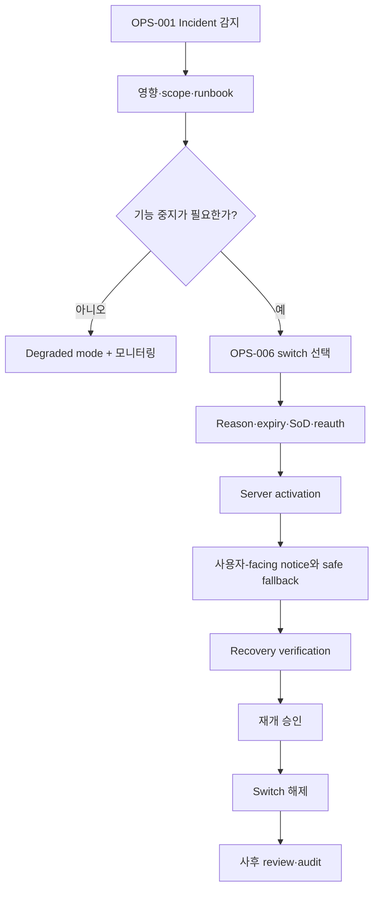

# Flow 10 — Incident와 Kill Switch

```mermaid
flowchart TD
  A[OPS-001 Incident 감지] --> B[영향·scope·runbook]
  B --> C{기능 중지가 필요한가?}
  C -- 아니오 --> D[Degraded mode + 모니터링]
  C -- 예 --> E[OPS-006 switch 선택]
  E --> F[Reason·expiry·SoD·reauth]
  F --> G[Server activation]
  G --> H[사용자-facing notice와 safe fallback]
  H --> I[Recovery verification]
  I --> J[재개 승인]
  J --> K[Switch 해제]
  K --> L[사후 review·audit]
```

## 불변조건

- switch는 scope와 expiry가 있다.
- broad switch는 two-person approval.
- public notice는 영향과 freshness를 설명한다.
- 재개는 원인 해결과 검증 후 수행한다.
